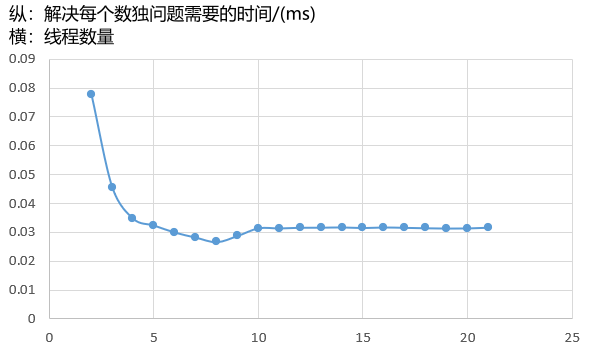

## 实验环境

①Linux环境：WSL Ubuntu20.04LTS

②处理器：Intel(R) Core(TM) i5-8300H CPU @ 2.30GHz

③内存：8.0GB

④1个物理CPU，4个内核，8个逻辑处理器。

## 实验内容

本实验是基于课程提供的求解数独的几种代码以及课程介绍的并发编程方法，采用求解数独最快的方法Dancing Link，并通过创建多线程（生产者、消费者模式）来完成数独的求解。

思路如下：首先将输入文件中的所有测试数据一次性读入并存储在数组中，然后创建一个缓冲区，缓冲区的大小与创建的消费者线程数量相同，然后多个创建生产者线程和消费者线程，竞争地访问缓冲区，载入或获取测试数据，并在消费者获取得到测试数据后再将测试数据由char转换为int，然后进行数独问题求解，最后将求解答案通过互斥访问条件变量来按输入顺序依次存储。

## 性能测试

单线程程序只能利用 1 个 CPU 核心，而多线程程序能使 CPU 的多个核心并行运作，因此，多线程能够充分发挥多核 CPU 的优势。在一定范围内，加速比会随着线程数的增加而增长，即时间开销越少、效率越高。当线程数超过 CPU 核心数时，性能会有所下降。

实验用共有 10 万道数独题的文件，而后分别使用单个sudoku_solve 线程和 n 个 sudoku_solve 线程（1个生产者线程+(n-1)个消费者线程）分别对该文件内的所有数独题进行求解，测量每个数独问题平均的求解时间开销。

从上图可以看出，当总线程数小于 CPU 总核（逻辑处理器）数时，随着线程数的增加，所需要的时间开销逐渐减小，当总线程数等于CPU总核心数时时间开销达到最小为0.026691ms。从sudoku_solve 线程数为 9 开始，总线程数超过 CPU 总核数，线程开始被操作系统调度，所以会有切换线程消耗的时间，同时调度会有一定的开销，所以性能会有所下降，同时趋于平缓。

